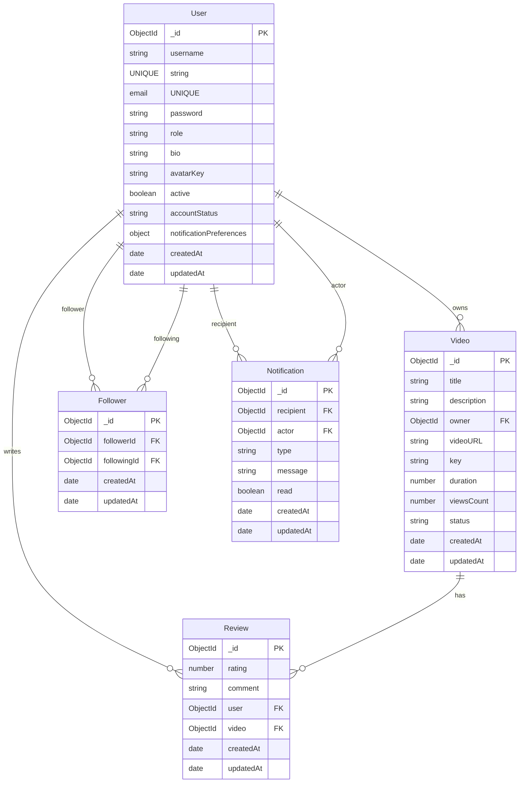

# ClipSphere MongoDB ER Diagram

```mermaid
erDiagram
  User {
    ObjectId _id PK
    string username UNIQUE
    string email UNIQUE
    string password
    string role
    string bio
    string avatarKey
    boolean active
    string accountStatus
    object notificationPreferences
    date createdAt
    date updatedAt
  }

  Video {
    ObjectId _id PK
    string title
    string description
    ObjectId owner FK
    string videoURL
    string key
    number duration
    number viewsCount
    string status
    date createdAt
    date updatedAt
  }

  Review {
    ObjectId _id PK
    number rating
    string comment
    ObjectId user FK
    ObjectId video FK
    date createdAt
    date updatedAt
  }

  Follower {
    ObjectId _id PK
    ObjectId followerId FK
    ObjectId followingId FK
    date createdAt
    date updatedAt
  }

  Notification {
    ObjectId _id PK
    ObjectId recipient FK
    ObjectId actor FK
    string type
    string message
    boolean read
    date createdAt
    date updatedAt
  }

  %% NOTE: Notification collection is planned for Phase 2/3 (real-time layer).
  %% It is not implemented in Phase 1; included here to show the intended future relationship.

  User ||--o{ Video : "owns"
  User ||--o{ Review : "writes"
  Video ||--o{ Review : "has"
  User ||--o{ Follower : "follower"
  User ||--o{ Follower : "following"
  User ||--o{ Notification : "recipient"
  User ||--o{ Notification : "actor"
```
