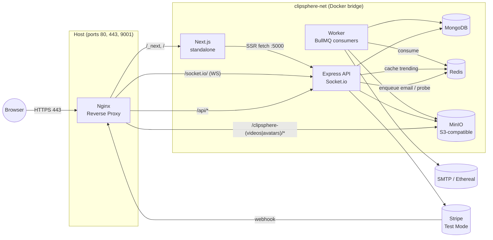

# ClipSphere Architecture (Phase 4)

The whole stack runs as 7 cooperating containers on a single Docker bridge network.
Nginx is the only container exposed to the host on ports 80 and 443 (and the
MinIO web console on 9001 for convenience). Everything else is reachable only
through the gateway.

## Request paths

| URL                              | Routed to            | Notes |
|----------------------------------|----------------------|-------|
| `/`                              | frontend:3000        | Next.js standalone server |
| `/_next/static/*`                | frontend:3000        | Cached 30 days in Nginx |
| `/api/*`                         | backend:5000         | Streamed body for uploads, 300 s timeout |
| `/api/v1/tips/webhook`           | backend:5000         | No buffering — Stripe raw body preserved |
| `/socket.io/*`                   | backend:5000         | WebSocket upgrade headers |
| `/api-docs`                      | backend:5000         | Swagger UI |
| `/api/v1/videos/for-you`         | backend:5000         | Bonus — protected, followed-first + trendingScore + 7-day freshness decay |
| `/clipsphere-videos/*`, `/clipsphere-avatars/*` | minio:9000 | Bucket paths routed directly with no rewrite so SigV4 canonical paths match |
| `/static/*`                      | nginx (alias)        | Local bundle |
| `/health-nginx`                  | nginx itself         | Healthcheck |

## Data flow examples

### Video upload
1. Browser POSTs `multipart/form-data` to `https://clipsphere.local/api/v1/videos/upload`.
2. Nginx streams the body to `backend:5000` (no buffering).
3. Backend middleware runs synchronous ffprobe — rejects if duration > 300 s.
4. Backend uploads bytes to MinIO via internal `minio:9000`, creates Mongo doc.
5. Backend enqueues a `video:probe` job to Redis and busts the trending cache.
6. Browser receives 201 immediately.
7. Worker container pulls the job, re-probes for full metadata, writes
   `width/height/codec` back to Mongo. Concurrency capped at 2 (CPU-bound).

### Trending feed
1. Browser GETs `https://clipsphere.local/api/v1/videos/trending?page=1&limit=20`.
2. Backend cache middleware computes key `cache:trending:v{N}:p1:l20`.
3. On HIT: respond from Redis in single-digit ms, header `X-Cache: HIT`.
4. On MISS: run the existing aggregation pipeline in `feed.service.js`, write
   the result back to Redis with TTL 60 s, header `X-Cache: MISS`.
5. Any like/upload/review increments `trending:version` — old keys orphan and
   are LRU-evicted; the next request rebuilds cleanly.

### Real-time like
1. Browser A clicks "Like" on a video owned by Browser B.
2. Backend `like.service` writes the Like, busts trending cache, then
   `io.to(ownerId).emit('new-like', {...})`.
3. Socket.io broadcasts only into the owner's private room.
4. Nginx forwards the WebSocket frame (Upgrade/Connection headers preserved) to
   Browser B's tab, which renders a toast.

## Persistence

| Volume           | Used by    | What it stores |
|------------------|-----------|----------------|
| `mongo_data`     | mongo     | All MongoDB collections |
| `minio_data`     | minio     | Uploaded videos, avatars, thumbnails |
| `redis_data`     | redis     | AOF persistence for queues + cache |
| `nginx_cache`    | nginx     | Proxy cache for static assets |

## Why this shape

- **Worker isolation.** ffprobe is CPU-bound and email sends are I/O-bound. Pulling
  them out of the API container keeps p95 request latency stable under load.
- **Version-bump cache invalidation.** `INCR trending:version` is O(1) and atomic.
  `KEYS cache:trending:*` is O(n) and blocks Redis — never used here.
- **Two S3 clients (internal + public).** Server code talks to `minio:9000` for
  PUT/HEAD/DELETE. The presigner uses `https://clipsphere.local` so the
  browser can resolve the host. Nginx forwards `/clipsphere-videos/*` and
  `/clipsphere-avatars/*` directly to MinIO without any path rewrite — any
  rewrite would change the canonical path the SDK signed, invalidating the
  signature.
- **Single backend replica.** Socket.io's in-memory room map is fine for one
  instance. Scaling out would require `@socket.io/redis-adapter` and Nginx
  `ip_hash` — out of Phase 4 scope, noted in the reflection.
